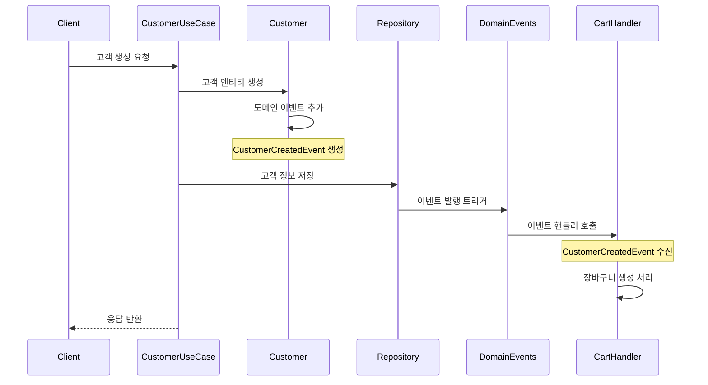
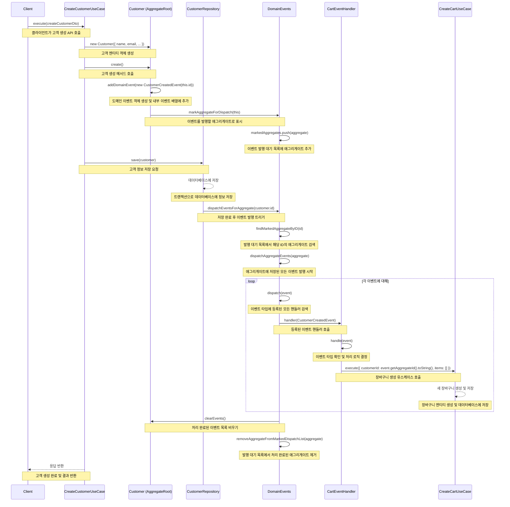

# 🚀 도메인 이벤트를 활용한 서비스 간 통신

## 📚 목차

- [개요](#개요)
- [도메인 이벤트란?](#도메인-이벤트란)
- [사용 시나리오](#사용-시나리오)
- [구현 예시: 고객 생성 시 장바구니 자동 생성](#구현-예시-고객-생성-시-장바구니-자동-생성)
- [주요 구성 요소 설명](#주요-구성-요소-설명)
- [도메인 이벤트 사용의 이점](#도메인-이벤트-사용의-이점)
- [도메인 이벤트 vs 다른대안](#도메인-이벤트-vs-다른대안)
- [구현 가이드라인](#구현-가이드라인)
- [주의 사항](#주의-사항)

## 🔍 개요

도메인 이벤트를 사용하여 서로 다른 바운디드 컨텍스트(bounded context) 간 통신을 구현한 방법을 설명합니다.
특히 Customer(고객) 생성 시 자동으로 Cart(장바구니)가 생성되는 기능의 구현 방식을 예시로 다룹니다.

## 💡 도메인 이벤트란?

도메인 이벤트(Domain Event)는 도메인 내에서 발생한 중요한 사건을 표현하는 객체입니다.
이는 애그리게잇(Aggregate)의 상태 변화나 중요한 비즈니스 프로세스의 완료를 나타냅니다. 도메인 이벤트는 다음과 같은 특징을 가집니다.

- **⏱️ 과거 시제로 명명**: CustomerCreated, OrderPlaced 등
- **🔒 불변(Immutable)**: 이벤트가 발생한 후에는 내용이 변경되지 않음
- **🏛️ 애그리게이트 루트에서 발행**: 항상 애그리게이트 루트에서 발생해야 함
- **🔄 느슨한 결합**: 이벤트 발행자와 구독자 간의 직접적인 의존성이 없음

## 🛠️ 사용 시나리오

도메인 이벤트는 다음과 같은 상황에서 특히 유용합니다.

### 1️⃣ **서로 다른 바운디드 컨텍스트 간 통신이 필요할 때**

- 예: 고객 생성 → 장바구니 생성
- 예: 브랜드 삭제 → 관련 상품 삭제

### 2️⃣ **프로세스 간 조율이 필요할 때**

- 예: 주문 완료 → 재고 감소 → 배송 준비

### 3️⃣ **비동기 작업 처리가 필요할 때**

- 예: 사용자 등록 → 환영 이메일 전송

## 🔄 구현 예시: 고객 생성 시 장바구니 자동 생성

아래 시퀀스 다이어그램은 고객이 생성될 때 자동으로 장바구니가 생성되는 전체 흐름을 보여줍니다.



<details>
<summary>🔍 시퀀스 다이어그램 더 자세히 보기</summary>



</details>

## 🧩 주요 구성 요소 설명

### 1️⃣ 도메인 이벤트 클래스

```typescript
export class CustomerCreatedEvent implements IDomainEvent {
  public dateTimeOccurred: Date;

  constructor(public readonly customerId: UniqueEntityId) {
    this.dateTimeOccurred = new Date();
  }

  getAggregateId(): UniqueEntityId {
    return this.customerId;
  }
}
```

### 2️⃣ 이벤트 생성과 발행

도메인 이벤트는 애그리게잇 루트에서 발생합니다.

```typescript
// Customer 애그리게이트의 create 메서드
create(): void {
  this.addDomainEvent(new CustomerCreatedEvent(this.id));
}
```

addDomainEvent 메서드는 AggregateRoot 클래스에서 상속받는 것으로, 이벤트를 애그리게잇의 내부 이벤트 목록에 추가하고 이벤트 발행을 위해 애그리게잇을 표시합니다.

```typescript
// AggregateRoot 클래스
protected addDomainEvent(domainEvent: IDomainEvent): void {
  this._domainEvents.push(domainEvent);
  DomainEvents.markAggregateForDispatch(this);
}
```

### 3️⃣ 이벤트 핸들러 구현

```typescript
@Injectable()
export class CartEventHandler implements OnModuleInit {
  constructor(private readonly createCartUseCase: CreateCartUseCase) {}

  onModuleInit() {
    // 이벤트 핸들러 등록
    DomainEvents.register(
      (event) => this.handle(event),
      CustomerCreatedEvent.name,
    );
  }

  async handle(event: IDomainEvent): Promise<void> {
    if (event.constructor.name === CustomerCreatedEvent.name) {
      const customerEvent = event as CustomerCreatedEvent;

      await this.createCartUseCase.execute({
        customerId: customerEvent.getAggregateId().toString(),
        items: [],
      });
    }
  }
}
```

### 4️⃣ 이벤트 발행 트리거

레포지토리에서 애그리게잇을 저장 후 이벤트를 발행합니다.

```typescript
// CustomerRepositoryImpl.ts
async save(customer: Customer): Promise<void> {
  // 데이터베이스에 저장

  // 저장 완료 후 이벤트 발행
  DomainEvents.dispatchEventsForAggregate(customer.id);
}
```

## ✨ 도메인 이벤트 사용의 이점

### 1️⃣ 느슨한 결합(Loose Coupling)

도메인 이벤트를 사용하면 서로 다른 바운디드 컨텍스트 간의 직접적인 의존성을 제거할 수 있습니다.
Customer 모듈은 Cart 모듈의 존재를 알 필요가 없으며, Cart 모듈은 이벤트를 통해 Customer 생성을 감지합니다.

```typescript
// 느슨한 결합 - Customer 모듈은 Cart에 대해 알지 못함
Customer --(CustomerCreatedEvent)--> [이벤트 버스] --> CartEventHandler
```

### 2️⃣ 확장성(Extensibility)

새로운 기능이 추가되어도 기존 코드를 수정할 필요가 없습니다.
예를 들어, 고객 생성 시 환영 이메일을 보내는 기능을 추가하려면 기존 코드를 변경하지 않고 새로운 이벤트 핸들러만 추가하면 됩니다.

### 3️⃣ 단일 책임 원칙(Single Responsibility Principle)

각 모듈은 자신의 핵심 책임에만 집중할 수 있습니다.

- ✅ Customer 모듈: 고객 생성 및 관리
- ✅ Cart 모듈: 장바구니 생성 및 관리

## 🔄 도메인 이벤트 vs 다른대안

애그리게이트 간 상호작용에 대한 접근 방식을 비교해보겠습니다. 다음과 같은 애그리게이트가 있다고 가정해 보겠습니다

- 🏢 **브랜드(Brand)**: 브랜드 애그리게이트 루트, 여러 상품을 관리하며 각 상품과 연관되어 있음
- 📦 **상품(Product)**: 상품 애그리게이트 루트, 각 상품은 하나의 브랜드에 소속됨

이때 다음과 같은 비즈니스 요구사항이 있습니다.

> "브랜드가 삭제될 때 상품을 삭제해주세요"

### 🔹 가능한 구현 접근법

#### 1. 데이터베이스 CASCADE 옵션 사용

```sql
CREATE TABLE products (
  id UUID PRIMARY KEY,
  brand_id UUID NOT NULL,
  FOREIGN KEY (brand_id) REFERENCES brands(id) ON DELETE CASCADE
);
```

이런 의문이 들 수 있습니다.

> "굳이 복잡한 도메인 이벤트를 사용할 필요가 있나요? 데이터베이스의 CASCADE 옵션만으로도 요구사항을 충족할 수 있지 않나요?"

#### 2. 도메인 이벤트 기반 접근

```typescript
// Brand 애그리게이트에서
delete(): void {
  this.addDomainEvent(new BrandDeletedEvent(this.id));
}

// ProductEventHandler에서
async handleBrandDeleted(event: BrandDeletedEvent) {
  await this.deleteProductsByBrandUseCase.execute(event.brandId);
}
```

### 🏆 도메인 이벤트의 우위성

데이터베이스 CASCADE 옵션은 다음과 같은 이유로 도메인 이벤트보다 제한적입니다.

1. 🔄 **생명주기가 다른 애그리게잇**: 각 애그리게잇은 자체 생명주기를 가지며, 데이터베이스 제약조건보다 도메인 규칙이 우선합니다.
2. 🌐 **마이크로서비스 고려**: 서비스가 분리되고 별도의 데이터베이스를 사용하게 되면 CASCADE 옵션은 사용할 수 없습니다.
3. 📚 **도메인 지식 표현**: 도메인 이벤트는 중요한 비즈니스 프로세스를 명시적으로 표현합니다.

## 📝 구현 가이드라인

### 1️⃣ 언제 도메인 이벤트를 사용할까?

- 🔄 서로 다른 애그리게이트나 바운디드 컨텍스트 간의 통신이 필요할 때
- 🔔 비즈니스적으로 중요한 상태 변화가 발생했을 때
- ⏱️ 비동기 처리가 필요한 작업이 있을 때
- 🔄 여러 서비스가 동일한 이벤트에 반응해야 할 때

### 2️⃣ 이벤트 명명 규칙

- ⏱️ 과거 시제 사용: CustomerCreated, OrderPaid, ProductDeleted
- 📋 명확한 이름 지정: 이벤트 이름만으로도 무슨 일이 발생했는지 알 수 있어야 함

### 3️⃣ 이벤트 페이로드 설계

- 📦 필요한 정보만 포함: 이벤트를 처리하는 데 필요한 최소한의 정보만 포함
- 💎 값 객체 사용: 가능하면 원시 타입보다 값 객체를 사용
- 🔑 식별자 포함: 관련 애그리게이트의 ID를 반드시 포함

### 4️⃣ 이벤트 핸들러 구현

- 🎯 단일 책임: 각 핸들러는 하나의 책임만 가져야 함
- 🔄 멱등성 보장: 같은 이벤트가 여러 번 처리되어도 문제없도록 구현
- 🛡️ 오류 처리: 이벤트 처리 실패에 대한 전략 수립 (재시도, 로깅 등)

## ⚠️ 주의 사항

1. 🔄 **이벤트 순서**: 이벤트의 처리 순서가 보장되지 않을 수 있음
2. 💾 **트랜잭션 관리**: 이벤트 발행과 처리가 별도의 트랜잭션에서 이루어질 수 있음
3. 📋 **이벤트 버전 관리**: 시스템 발전에 따라 이벤트 구조가 변경될 수 있음
