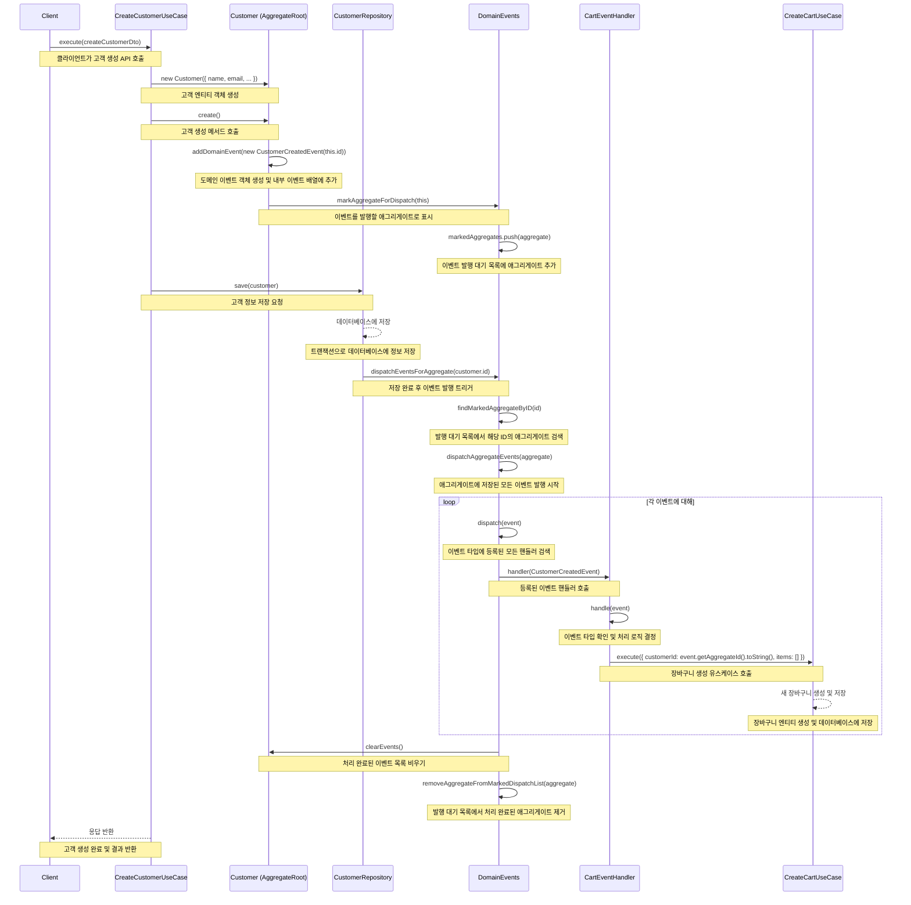

```mermaid
sequenceDiagram
    participant Client
    participant CreateCustomerUseCase
    participant Customer as Customer (AggregateRoot)
    participant CustomerRepo as CustomerRepository
    participant DomainEvents
    participant CartEventHandler
    participant CartUseCase as CreateCartUseCase

    Client->>CreateCustomerUseCase: execute(createCustomerDto)
    Note over Client,CreateCustomerUseCase: 클라이언트가 고객 생성 API 호출

    CreateCustomerUseCase->>Customer: new Customer({ name, email, ... })
    Note over CreateCustomerUseCase,Customer: 고객 엔티티 객체 생성

    CreateCustomerUseCase->>Customer: create()
    Note over CreateCustomerUseCase,Customer: 고객 생성 메서드 호출

    Customer->>Customer: addDomainEvent(new CustomerCreatedEvent(this.id))
    Note over Customer: 도메인 이벤트 객체 생성 및 내부 이벤트 배열에 추가

    Customer->>DomainEvents: markAggregateForDispatch(this)
    Note over Customer,DomainEvents: 이벤트를 발행할 애그리게이트로 표시

    DomainEvents->>DomainEvents: markedAggregates.push(aggregate)
    Note over DomainEvents: 이벤트 발행 대기 목록에 애그리게이트 추가

    CreateCustomerUseCase->>CustomerRepo: save(customer)
    Note over CreateCustomerUseCase,CustomerRepo: 고객 정보 저장 요청

    CustomerRepo-->>CustomerRepo: 데이터베이스에 저장
    Note over CustomerRepo: 트랜잭션으로 데이터베이스에 정보 저장

    CustomerRepo->>DomainEvents: dispatchEventsForAggregate(customer.id)
    Note over CustomerRepo,DomainEvents: 저장 완료 후 이벤트 발행 트리거

    DomainEvents->>DomainEvents: findMarkedAggregateByID(id)
    Note over DomainEvents: 발행 대기 목록에서 해당 ID의 애그리게이트 검색

    DomainEvents->>DomainEvents: dispatchAggregateEvents(aggregate)
    Note over DomainEvents: 애그리게이트에 저장된 모든 이벤트 발행 시작

    loop 각 이벤트에 대해
        DomainEvents->>DomainEvents: dispatch(event)
        Note over DomainEvents: 이벤트 타입에 등록된 모든 핸들러 검색

        DomainEvents->>CartEventHandler: handler(CustomerCreatedEvent)
        Note over DomainEvents,CartEventHandler: 등록된 이벤트 핸들러 호출

        CartEventHandler->>CartEventHandler: handle(event)
        Note over CartEventHandler: 이벤트 타입 확인 및 처리 로직 결정

        CartEventHandler->>CartUseCase: execute({ customerId: event.getAggregateId().toString(), items: [] })
        Note over CartEventHandler,CartUseCase: 장바구니 생성 유스케이스 호출

        CartUseCase-->>CartUseCase: 새 장바구니 생성 및 저장
        Note over CartUseCase: 장바구니 엔티티 생성 및 데이터베이스에 저장
    end

    DomainEvents->>Customer: clearEvents()
    Note over DomainEvents,Customer: 처리 완료된 이벤트 목록 비우기

    DomainEvents->>DomainEvents: removeAggregateFromMarkedDispatchList(aggregate)
    Note over DomainEvents: 발행 대기 목록에서 처리 완료된 애그리게이트 제거

    CreateCustomerUseCase-->>Client: 응답 반환
    Note over CreateCustomerUseCase,Client: 고객 생성 완료 및 결과 반환
```
